# 🧩 Práctica GitHub Actions — Proyecto con Next.js

## 📝 1. Introducción

Esta práctica tiene como objetivo crear un flujo de trabajo completo (**workflow**) en **GitHub Actions** para automatizar diferentes tareas dentro de un proyecto desarrollado con **Next.js**.  
El workflow realiza análisis de código, pruebas automáticas con **Cypress**, añade una insignia con los resultados, despliega el proyecto en **Vercel**, y finalmente envía un correo notificando el estado del workflow.

---

## ⚙️ 2. Configuración inicial del repositorio

Primero se clonó el repositorio base y se configuró el propio repositorio en GitHub:

```bash
git clone https://github.com/antoni-gimenez/nodejs-blog-practica.git
cd nodejs-blog-practica
git remote remove origin
git remote add origin https://github.com/alexsegui10/github_actions.git
git branch -M main
git push -u origin main
```


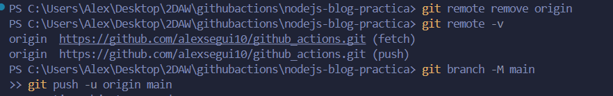


---

## 🧱 3. Creación del Workflow principal

Dentro de la carpeta `.github/workflows/` se creó el archivo `main.yml`.  
Este archivo define toda la automatización del proyecto.


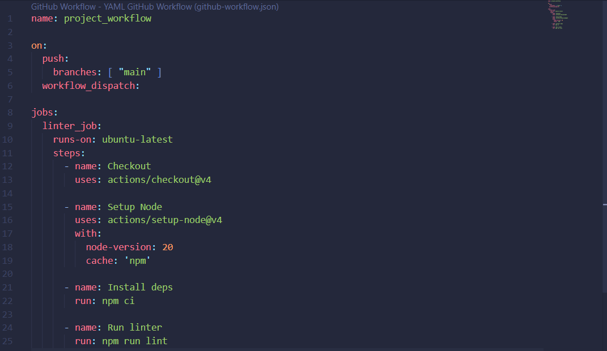

---

### 🧩 Linter Job

Este job analiza el código con **ESLint** para detectar errores de estilo o sintaxis.

```yaml
linter_job:
  runs-on: ubuntu-latest
  steps:
    - name: Checkout
      uses: actions/checkout@v4

    - name: Setup Node
      uses: actions/setup-node@v4
      with:
        node-version: 20
        cache: 'npm'

    - name: Install deps
      run: npm ci

    - name: Run linter
      run: npm run lint
```

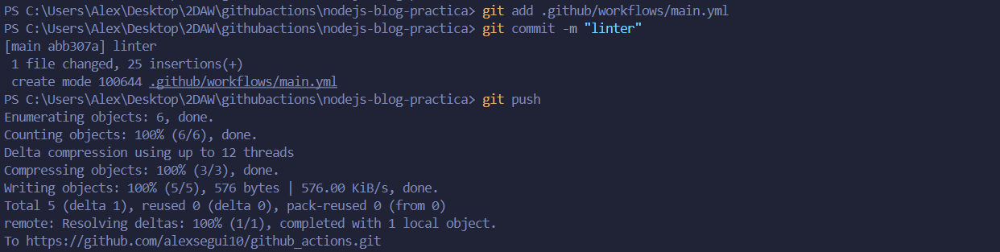
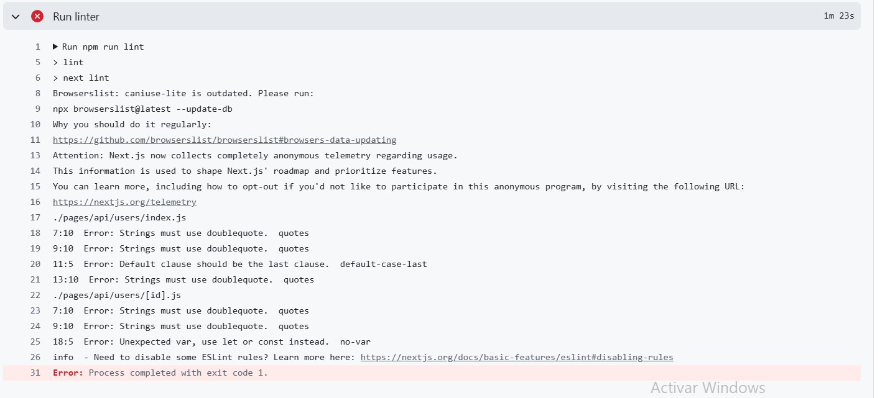
Habia un erro de sintaxis y al arreglarlo ya no salia el error.


---

### 🧪 Cypress Job

Este job ejecuta los tests automáticos del proyecto con **Cypress**.  
Aunque los tests fallen, el workflow continúa para mostrar el resultado en el *badge* y los artefactos.


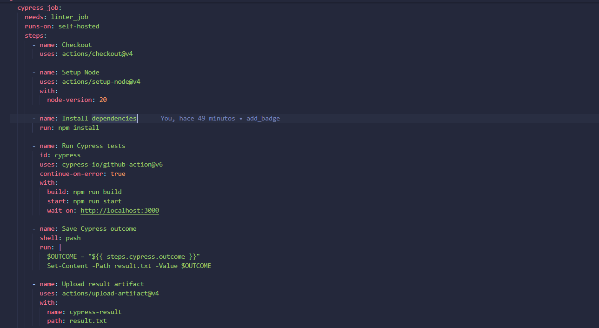

---

### 🏷️ Add Badge Job

Este job añade automáticamente una insignia al `README.md` con el estado actual de los tests.  
Para ello, se creó una acción personalizada dentro de `.github/actions/add_badge/` que incluye:

- `action.yml`
- `add_badge.js`

📸 **Captura:** el *badge* se actualiza correctamente tras cada ejecución del workflow.
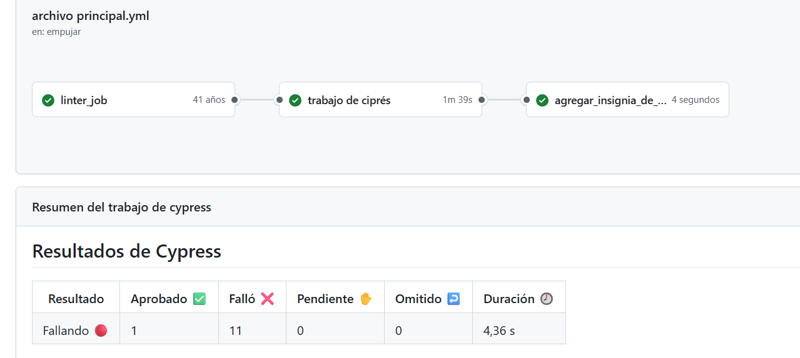
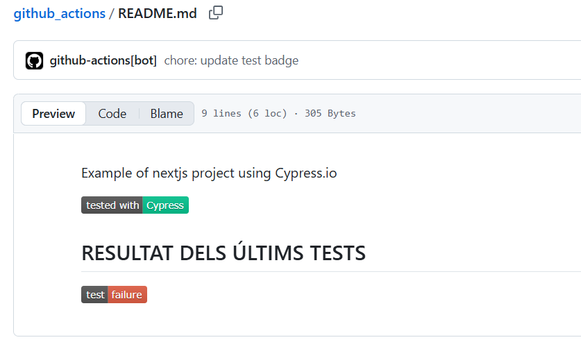

---

### 🚀 Deploy Job (Vercel)

Este job se encarga de desplegar automáticamente el proyecto en **Vercel**.  
Para su funcionamiento, se configuraron los siguientes secretos en el repositorio:

| Nombre | Descripción |
|--------|--------------|
| `VERCEL_TOKEN` | Token de autenticación de Vercel |
| `VERCEL_ORG_ID` | ID de la organización o usuario |
| `VERCEL_PROJECT_ID` | ID del proyecto en Vercel |

.

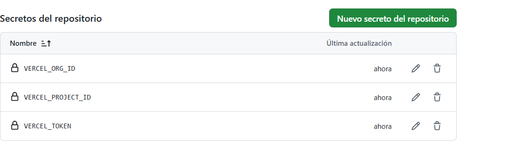
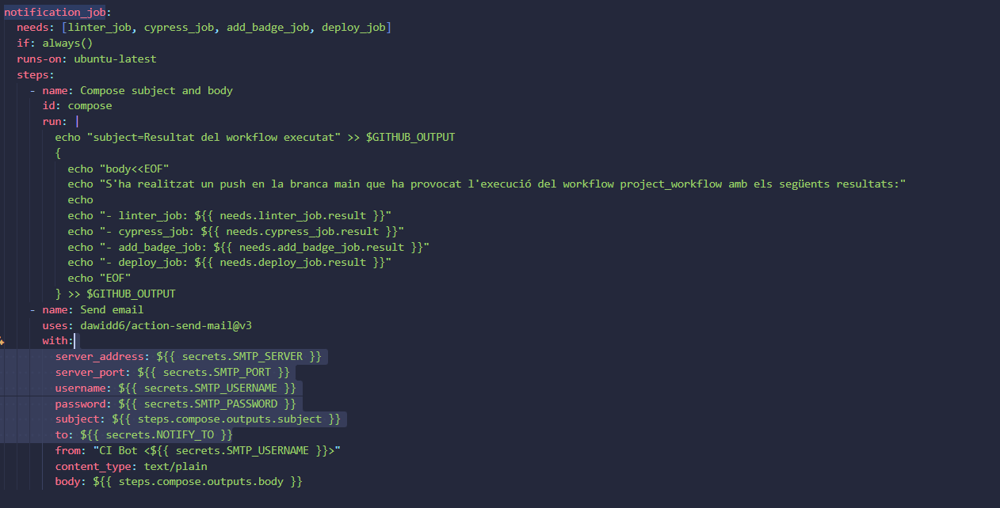

---

### ✉️ Notification Job (Correo electrónico)

Por último, se añadió un job que envía un correo con los resultados del workflow.  
Se utilizó la acción `dawidd6/action-send-mail@v3`.

Antes, fue necesario generar una **contraseña de aplicación** en Google para poder usar el servidor SMTP.


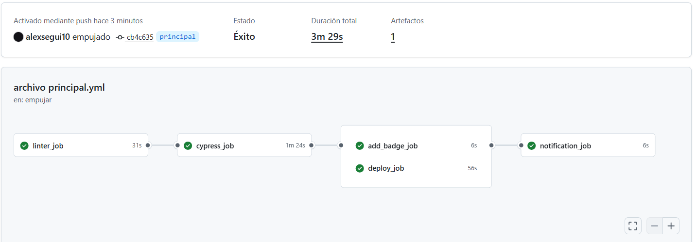
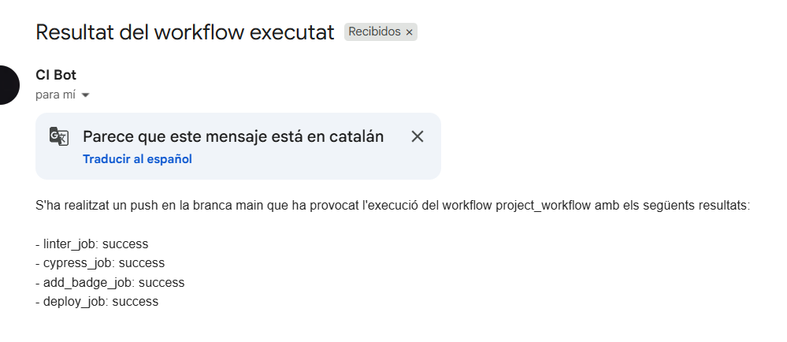

---

## ✅ 4. Resultado final del workflow

El workflow final ejecuta los siguientes jobs en orden:

1. `linter_job`
2. `cypress_job`
3. `add_badge_job`
4. `deploy_job`
5. `notification_job`


---

## 📦 5. Resultado en README

El `README.md` del repositorio se actualiza automáticamente con una insignia que indica el resultado del último test:

```
Example of nextjs project using Cypress.io

tested with  [Cypress]

RESULTAT DELS ÚLTIMS TESTS


[test: success]
```


---

## 🧾 6. Conclusión

Este proyecto demuestra la potencia de **GitHub Actions** en la automatización de tareas:

- ✅ Análisis automático del código con ESLint  
- ✅ Ejecución de pruebas con Cypress  
- ✅ Inserción automática de insignias en el README  
- ✅ Despliegue continuo en Vercel  
- ✅ Notificación automática por correo  

Con este flujo, se garantiza que cada cambio en el repositorio pase por validaciones automáticas y se despliegue únicamente código correcto y probado.


---

---

## 👤 Autor

**Nombre:** Alex Seguí  
**Repositorio:** [https://github.com/alexsegui10/github_actions](https://github.com/alexsegui10/github_actions)  
<!-- **Despliegue en Vercel:** [https://tu-proyecto.vercel.app](https://tu-proyecto.vercel.app) -->
